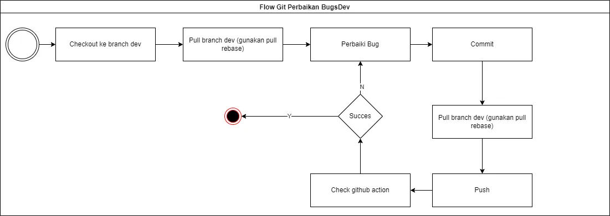
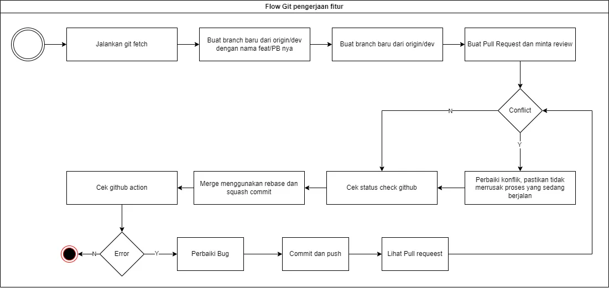
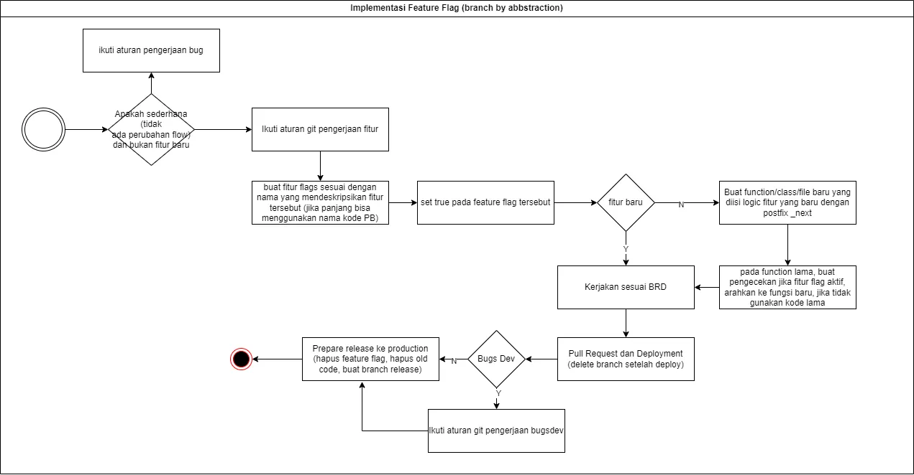

	
	<h1>Knitto Backend Apps</h1>
	*Ini adalah boiler plate untuk aplikasi Backend yang ada di knitto*

# Struktur Project
struktur project bisa dilihat di [sini](https://github.com/knittotextile/rest-boilerplate-ts/blob/dev/Struktur%20Project.md)

## Instalasi aplikasi (development)
1. Login ke npm github knitto
2. Jalankan ``pnpm install``
3. Jalankan ``pnpm dev``

## Flow Git BugsDev

## Flow Git Development Fitur

## Flow Fitur Flags (Branch by Abstractions)
Fitur flag disini berfungsi sebagai penjaga fitur-fitur baru tidak di eksekusi di server production.

## Aturan deploy ke production
1. Dinyatakan lolos testing oleh team tester
2. Hapus fitur flag dan old code pada fitur-fitur yang akan di rilis
3. Buat branch baru dari origin/dev beri nama releases/vX.X.X.X

### Notes
1. Aturan commit menggunakan conventional commit
2. Node v.20.11.1
3. Package manager pnpm
